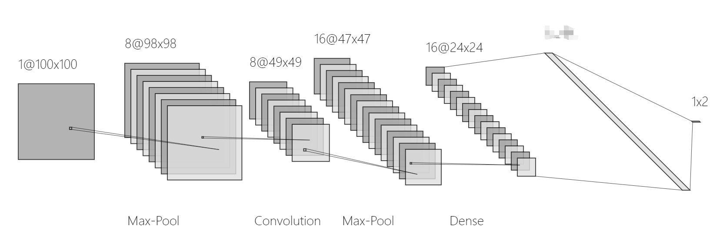
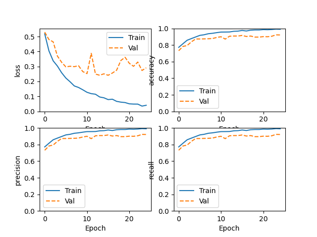
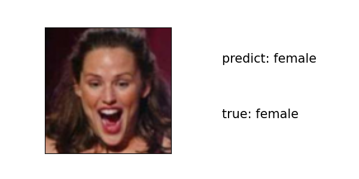
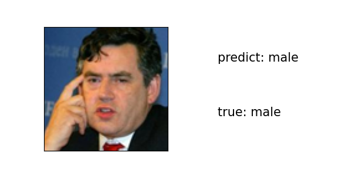

# README

data_loader.py     读取图片数据和txt内的标签数据

image_CNN.py      卷积神经网络


## 网络结构

使用的最基本的卷积神经网络，网络结构与示例代码中的一样



```python
Model: "sequential"
_________________________________________________________________
Layer (type)                 Output Shape              Param #   
=================================================================
conv2d (Conv2D)              (None, 98, 98, 8)         224       
_________________________________________________________________
max_pooling2d (MaxPooling2D) (None, 49, 49, 8)         0         
_________________________________________________________________
conv2d_1 (Conv2D)            (None, 47, 47, 16)        1168      
_________________________________________________________________
max_pooling2d_1 (MaxPooling2 (None, 23, 23, 16)        0         
_________________________________________________________________
flatten (Flatten)            (None, 8464)              0         
_________________________________________________________________
dense (Dense)                (None, 2)                 16930     
=================================================================
Total params: 18,322
Trainable params: 18,322
Non-trainable params: 0
_________________________________________________________________
```


## 损失函数




## 预测结果





```
-----------------------
Evaluating the trained model.
Test loss: 0.29126352071762085
Test accuracy: 0.9214285612106323
---------------------------

true_predict_num:  645
true_predict_rate:  0.9214285714285714
true_predict_male_num:  487
true_predict_female_num:  158
true_predict_male_rate:  0.974
true_predict_female_rate:  0.79
```

