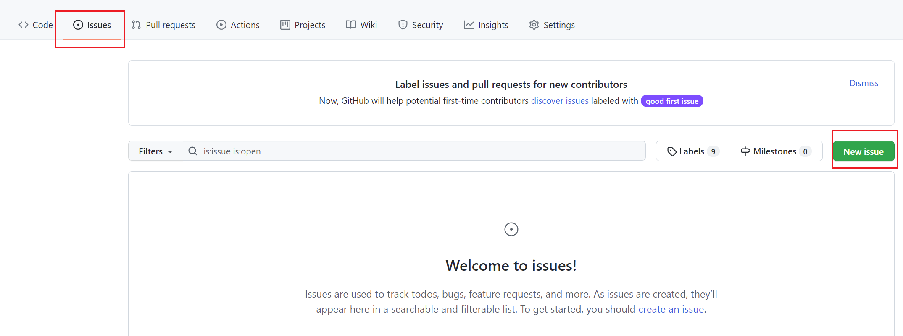

# Git

## 如何学习使用Git

### 安装Git

Windows系统

[Git - Downloading Package (git-scm.com)](https://git-scm.com/download/win)

详细安装教程：[Git安装教程（Windows安装超详细教程） - 简书 (jianshu.com)](https://www.jianshu.com/p/414ccd423efc)


### Git绑定Github账号

[Git与Github使用教程（一）--Git安装、Git账户与GitHub账户连接 - 简书 (jianshu.com)](https://www.jianshu.com/p/faf744f719e6)


### 使用Git

[Learn Git Branching](https://learngitbranching.js.org/?locale=zh_CN)

使用此网站可以学习**Git**的主要命令与分支的合并情况


### 本地仓库与远程仓库绑定

首选进入想要存放项目的本地仓库文件夹（没有就新建一个）

使用 **git** 命令初始化文件夹

```git
git init 
```

然后进行远程连接

```git
git remote add origin https://github.com/xxxxlc/Group-of-ML.git
```


## 在Github上利用issue提问




如果在代码中遇到问题，小组成员可以通过Github的issue提出问题，其他成员可以对其进行回答与修改

（在微信群也可，:laughing: ，不过利用issue更有开发的感觉）


## 如何删除Github上的.idea文件夹

什么是.idea文件夹：[为Git仓库里的.idea文件夹正名 - 知乎 (zhihu.com)](https://zhuanlan.zhihu.com/p/38348372)

上传时不上传.idea文件夹：[怎么从git仓库中删除.idea文件夹 - 开发技术 - 亿速云 (yisu.com)](https://www.yisu.com/zixun/372669.html)

利用Pycharm自带工具进行.gitignore文件的配置：[PyCharm/IDEA等工具使用git时设置不要提交系统文件，或者忽略提交文件夹_风闻有BUG-CSDN博客](https://blog.csdn.net/luhuibo318/article/details/89742169)

